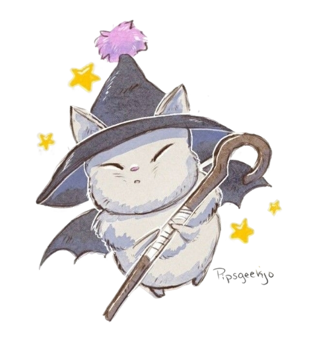

  
  
  

@lifenock on all platforms

fullstack developer & reverse engineering

founder @ monoxide

<h2 align="center">my stack</h2>

  

<h2 align="center">what i do</h2>

currently working on webports and monoxide, and grinding for my comptia cert rn
  
mostly random c++, c# and lua, plus web stuff that's actually kinda useful
  
i dual boot arch and windows for different things
  
i love picking apart game clients

<h2 align="center">projects</h2>

monoxide
 
a pile of web ports (roblox, ultrakill, deltarune, and more)

most things i do arent posted to github, but ill try to get to it more often!

<h2 align="center">activity</h2>

  

  
  

